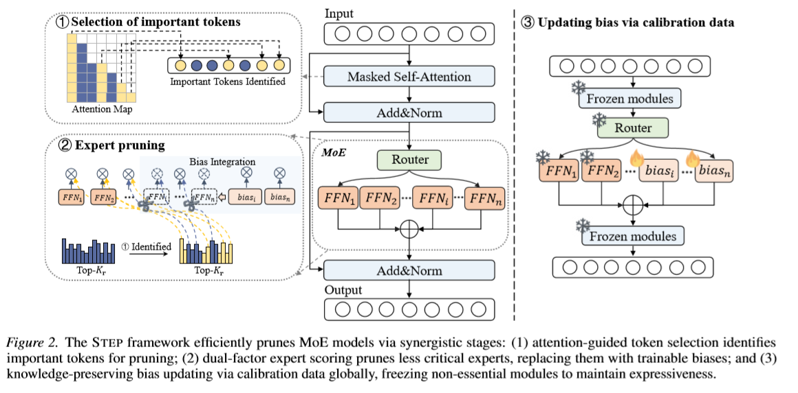

# Less Token, More Signal: MoE Expert Pruning via Critical Token Selection [ICML2026]

This repository contains the implementation of **STEP** (Selective Token-based Expert Pruning), a framework for efficiently pruning Mixture-of-Experts (MoE) models through attention-guided token selection and expert scoring. For details see [Less Token, More Signal: MoE Expert Pruning via Critical Token Selection]



## Overview

The STEP framework efficiently prunes MoE models via three synergistic stages:

1. **Selection of Important Tokens**: Attention-guided token selection identifies important tokens for pruning by analyzing the attention map to find the most informative positions.

2. **Expert Pruning**: Dual-factor expert scoring prunes less critical experts, replacing them with trainable biases based on critical token selection.

3. **Updating Bias via Calibration Data**: Knowledge-preserving bias updating via calibration data globally, freezing non-essential modules to maintain expressiveness.

## Installation

### 1. Clone and Setup

```bash
cd /data1/STEPMoE
export PYTHONPATH=$PWD:$PYTHONPATH
```

### 2. Install Dependencies

Install core dependencies:

```bash
pip install -r requirement.txt
```

### 3. Install lm-evaluation-harness

For model evaluation, install [lm-evaluation-harness](https://github.com/EleutherAI/lm-evaluation-harness):

```bash
pip install lm-eval==0.3.0
```

## Dataset Preparation

The STEP framework requires calibration data to identify important tokens and guide expert pruning. We support two calibration datasets:

- **C4**: General domain text (default)
- **Evol-Alpaca**: Code domain text (for code&math pruning)

### Step 1: Prepare Directory Structure

Create the calibration data directory:

```bash
mkdir -p calib_data/c4
mkdir -p calib_data/evol-alpaca
```

### Step 2: Download C4 Dataset (Required)

Download a C4 sample file (~500MB) from HuggingFace:

```bash
wget https://huggingface.co/datasets/allenai/c4/resolve/main/en/c4-train.00000-of-01024.json.gz -P calib_data/c4/
gunzip calib_data/c4/c4-train.00000-of-01024.json.gz
```

Or download manually from [allenai/c4](https://huggingface.co/datasets/allenai/c4/blob/main/en/c4-train.00000-of-01024.json.gz).

### Step 3: Download Evol-Alpaca Dataset (Optional)

For code domain pruning, download the Evol-Alpaca dataset:

```bash
wget https://huggingface.co/datasets/theblackcat102/evol-codealpaca-v1/resolve/main/train.jsonl -P calib_data/evol-alpaca/
```

Or download manually from [theblackcat102/evol-codealpaca-v1](https://huggingface.co/datasets/theblackcat102/evol-codealpaca-v1).

### Custom Dataset Path

To use a custom calibration dataset, modify `step/minipile.py`:

```python
DATASETS = {
    'c4': lambda: load_dataset('json', data_files={'train': 'your/path/to/c4.json'}),
    'code-alpaca': lambda: load_dataset('json', data_files={'train': 'your/path/to/alpaca.jsonl'}),
}
```

## Usage

### Expert Pruning with STEP

Run the STEP pruning method on OLMoE-1B-7B:

```bash
bash scripts/expert_prune_step.sh
```

This script prunes the model to 48 and 32 experts respectively using the STEP method with critical token selection.

### Other Pruning Methods

We also provide baseline methods for comparison:

**Frequency-based Pruning (Freq)**:
```bash
bash scripts/expert_prune_freq.sh
```

**Routing-score Pruning (GS)**:
```bash
bash scripts/expert_prune_gs.sh
```

**MoNE Pruning**:
```bash
bash scripts/expert_prune_mone.sh
```

## Code Structure

```
STEPMoE/
├── step/
│   ├── prune.py              # Main pruning script
│   ├── model/                # Model implementations
│   ├── pruning/              # Pruning algorithms
│   ├── dataset/              # Dataset utilities
│   └── lib/                  # Additional utilities
├── scripts/                  # Pruning scripts for different methods
│   ├── expert_prune_step.sh  # STEP method
│   ├── expert_prune_freq.sh  # Frequency baseline
│   ├── expert_prune_gs.sh    # Gradient scoring baseline
│   └── expert_prune_mone.sh  # MoNE baseline
├── calib_data/               # Calibration datasets
│   ├── c4/
│   └── evo-alpaca/
└── requirement.txt           # Core dependencies
```

## Key Arguments

The main pruning script (`step/prune.py`) supports the following key arguments:

| Argument | Description | Default |
|----------|-------------|---------|
| `--model_name_or_path` | Path to the pretrained MoE model | Required |
| `--expert_prune` | Enable expert pruning | False |
| `--preserve_n_experts` | Number of experts to preserve | 48 |
| `--expert_ranking_scope` | Scope for expert ranking (`layer` or `model`) | layer |
| `--expert_prune_metric` | Pruning metric (`step`, `freq`, `mone`, `routing_score`) | step |
| `--expert_ranking_metric` | Expert_ranking_metric | fusion |
| `--max_steps` | Number of calibration samples | 128 |
| `--tau` | Threshold for critical token selection | 0.5 |

## Example: Prune OLMoE-1B-7B to 32 Experts

```bash
export PYTHONPATH=$PWD:$PYTHONPATH

python step/prune.py \
    --model_name_or_path allenai/OLMoE-1B-7B-0125 \
    --expert_prune \
    --preserve_n_experts 32 \
    --expert_ranking_scope layer \
    --expert_prune_metric step \
    --expert_ranking_metric fusion \
    --max_steps 128 \
    --tau 0.5
```

## Model Output

Pruned models are saved to the specified output directory with:
- Pruned expert configuration
- Trainable bias terms for knowledge preservation

## Evaluation

Use `lm-eval` to evaluate the pruned model:

```bash
lm_eval --model hf \
    --model_args pretrained=<path_to_pruned_model> \
    --tasks <task_name> \
    --batch_size 8
```

## Requirements

- Python 3.10+
- PyTorch 2.3+
- Transformers 4.55+
- CUDA 12.1+ (for GPU acceleration)

## Acknowledgement
Our repository is built on the [HC-SMoE](https://github.com/wazenmai/HC-SMoE), [MoNE](https://github.com/zxgx/mode-pd), [SparseGPT](https://github.com/IST-DASLab/sparsegpt), we sincerely thank the authors for their nicely organized code!


## License

This project is licensed under the Apache License 2.0. See the [LICENSE](LICENSE) file for details.
